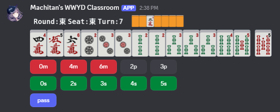
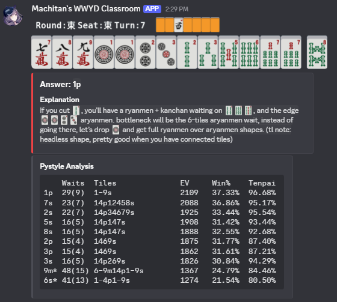
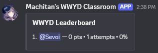

# WWYD Discord Bot

This bot sends out Riichi Mahjong WWYD quizzes every day at 10am ET for members to complete. It also includes a leaderboard with stat tracking, and offers members an option to do practice WWYDs.

Massive thanks to the folks at UW Riichi Club for inspiring this project.

## Commands

* `/wwyd random`: Generates a random WWYD for practice
* `/wwyd daily leaderboard`: Guild leaderboard
* `/wwyd daily score`: Guild score
* `/wwyd daily toggle`: Toggles wwyd daily for the channel (Users will require Manage-Channels Permission)
* `/wwyd daily force`: Forces the bot to send a daily WWYD in the channel (Users will require Manage-Channels Permission)

## Invite

[Discord OAuth Invite Link](https://discord.com/oauth2/authorize?client_id=1434270517128466574&permissions=68608&integration_type=0&scope=bot+applications.commands)

## Bot Examples

