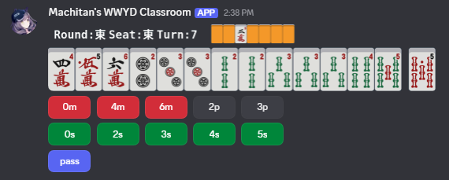
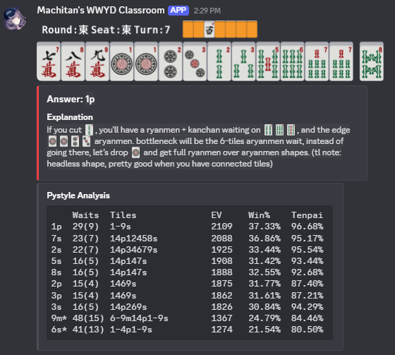
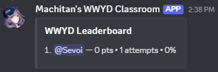

# WWYD Discord Bot

This bot sends out Riichi Mahjong WWYD quizzes every day at 10am ET for members to complete. It includes a leaderboard
with stat tracking, and offers members an option to do practice WWYDs.

Massive thanks to the folks at UW Riichi Club for inspiring this project.

## Invite

[Discord OAuth Invite Link](https://discord.com/oauth2/authorize?client_id=1434270517128466574&permissions=68608&integration_type=0&scope=bot+applications.commands)

## Commands

Daily Wwyd:

* `/wwyd leaderboard`: Guild leaderboard. Optional parameter `season` to select which season to use
* `/wwyd score`: Guild score. Optional parameter `season` to select which season to use

Wwyd Config (Requires Manage-Channels Permission to use)

* `/wwyd_config toggle`: Toggles wwyd daily for the channel (Users will require Manage-Channels Permission)
* `/wwyd_config force`: Forces the bot to send a daily WWYD in the channel (Users will require Manage-Channels
  Permission)

Random Commands:

* `/wwyd_random`: Generates a random WWYD for practice
* `/pystyle`: Evaluates a inputted hand with PyStyle

## How to Use

To setup daily quizzes, run `/wwyd_config toggle` in a discord channel. This will make the bot send out daily WYWYD
quizzes at 10am ET. You can also run `/wwyd_config force` to force send another daily wwyd. The wwyd that comes from this
will update in the database.

To practice on your own, you can do `wwyd_random` which will send an ephermeal message to you with a formatted WWYD.

## Examples

